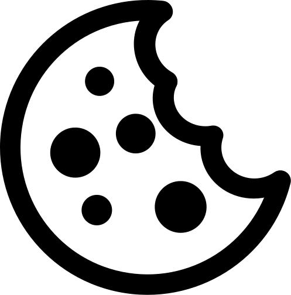
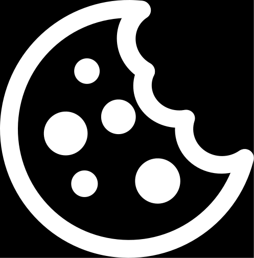
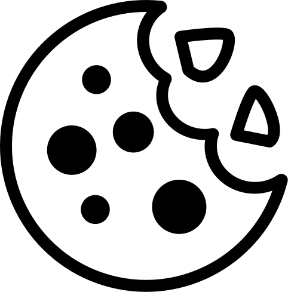

# Cookies
Who doesn't like cookies? These cookies were made to be integrated with [Font Awesome](https://fortawesome.github.io/Font-Awesome/). Can also be used independently.

[Suggestion thread](https://github.com/FortAwesome/Font-Awesome/issues/2845)

## Cookie

## Cookie inverted

## Cookie with crumbs

## Cookie with crumbs inverted

Images are made with [Inkscape](https://inkscape.org/).

  
   
  To the extent possible under law,
  <a rel="dct:publisher"
     href="https://github.com/whitebird/">
    Sebastiaan Jansen</a>
  has waived all copyright and related or neighboring rights to
  Cookie.
This work is published from:

  Belgium.

